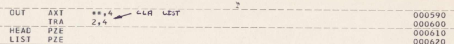

*Project Name*: ELIZA MAD/SLIP Reconstruction

*Description*: This document describes what was undertaken in 2024 to
restore ELIZA into a form that could be run on an emulator. See also
the [paper](http://arxiv.org/abs/2501.06707) which provides much more
context on ELIZA and CTSS than given here.

*Created*: 16 January 2025

*Version History*: See [github](https://github.com/rupertl/eliza-ctss/commits/main/RECONSTRUCTION-CARD.md).

*Card Author*: Rupert Lane

---

There are three components to this reconstruction:

* the emulated machine and operating system
* the SLIP library of supporting list-processing functions
* the ELIZA main program code/scripts.

# Emulated machine and operating system

*Inputs*:

* The IBM 7094 emulator
  [s709](https://cozx.com/dpitts/tarballs/ibm709x/s709-2.4.3.tar.gz)
* The reconstructed CTSS operating system
  [ctss-kit](https://cozx.com/dpitts/tarballs/ibm709x/ctss-1.0.7.kit.tar.gz)
* The set of
  [utilities](https://cozx.com/dpitts/tarballs/ibm709x/utils-1.1.14.tar.gz)
  to convert file formats.

*Result*:

* A working IBM 7094 emulated machine running CTSS.

These components are essentially unchanged from the upstream versions
created by [Dave Pitts](https://cozx.com/dpitts/ibm7090.html).

We did the following work

* automate some of the setup steps in `ctss/scripts`.
* fix some host portability issues (as of 16 January 2025 these had
  all been rolled into the upstream version).
* document how to use the emulator and operating system in
  [`README.md`](README.md) and [`HACKING.md`](HACKING.md).

# SLIP

*Inputs*: 

* The SLIP library printout
[02-000311065.pdf](https://github.com/jeffshrager/elizagen.org/blob/master/1965_Weizenbaum_MAD-SLIP/Slip/CTSS/02-000311065.pdf)
found amongst Weizenbaum's papers.
* The emulated machine and operating system described above.

*Result*: 

A CTSS library file containing all the functions needed by ELIZA. In
the CTSS environment this is named as `SLIP BSS`.

## Convert the PDF into source code files

We transcribed the input PDF to a single text file. This was done by
hand as OCR techniques did not produce usable results.

Page 2 had a hand-written comment at the top indicating an instruction
needs to be added. We inserted this in the text file.



Page 9 is a duplicate of page 5, so we removed it from the
transcription.

We then split the updated transcription into 66 individual MAD or FAP
source code files (using the file names indicated at the top of each
function).

## Categorise source code files

We categorised each file by moving it into a sub-directory of
`eliza/src/SLIP`.

| Sub-directory     | Meaning                                               |
|-------------------|-------------------------------------------------------|
| `SLIP-fap`        | Low level FAP assembly language functions             |
| `SLIP-core`       | Main set of SLIP functions in MAD                     |
| `SLIP-eliza`      | SLIP functions we believe were only used by ELIZA     |
| `SLIP-duplicates` | Functions in FAP that also had implementations in MAD |
| `SLIP-discarded`  | Functions not in the call graph of ELIZA              |

We did not compile or process further everything in:

- `SLIP-discarded`

## Load files into CTSS

We added a new user `SLIP` to the emulated CTSS system.

Each file from

- `SLIP-fap`
- `SLIP-core`
- `SLIP-duplicates`
- `SLIP-eliza`

was uploaded to the SLIP directory on CTSS using CTSS filename
conventions, so `init.fap` on the host becomes `INIT FAP` on the
emulated system. Note that CTSS does not support user sub-directories
so all files go to the `SLIP` home directory, ie the categorisation is
not preserved once the files are in CTSS.

## Test compiles for each source file

On CTSS we compiled and loaded each file singly and checked the
compiler output to spot any typos in the transcription and fixed them.

Apart from typo fixes, no other change was made to these functions.

## Identify missing functions

The test compile and load also showed us the call graph, ie what sub
functions are called by each function in the library. We identified
three missing functions:

| Function | Called from                | Purpose                                                 |
|----------|----------------------------|---------------------------------------------------------|
| `bcdit`  | `frbcd.mad`                | Convert a binary number into a string of BCD characters |
| `inlstl` | `xmatch.mad`, `assmbl.mad` | Merge two lists                                         |
| `letter` | `listrd.mad`               | Categorise a BCD character into a type code             |

## Implement missing functions

We added two directories to hold new work created by us to implement
the above.

| Sub-directory        | Meaning                             |
|----------------------|-------------------------------------|
| `SLIP-reconstructed` | Functions missing from the printout |
| `SLIP-tests`         | Tests for the above functions       |

We then implemented each missing function by looking at the context it
was used and writing new code in MAD. For `inlstl` we could also refer
to a FORTRAN implementation for a different platform.

We also wrote unit tests for each new function to confirm they behaved
as expected.

## Build the library

To produce the library, we wrote a build script
[make.runcom](eliza/src/SLIP/runcom/make.runcom) that could run on
CTSS. (Note that no information about how to build the source was
present in the original printout). To summarise what this does

- Compile everything in
  - `SLIP-fap`
  - `SLIP-core`
  - `SLIP-eliza`
  - `SLIP-reconstructed`
- Compile the tests in `SLIP-test` and run them
- Removed the modules `FRBCD MAD` and `LISTP MAD` from the result as
versions existed in the ELIZA source code we wanted to use instead.
- Combine object code  to produce the output result file `SLIP BSS`
- Copy this to the CTSS common file directory 4 so it can be used by ELIZA.

## Alternative way to build the library

In February 2025, we took a look again at the files in
`SLIP-duplicates`. These are implementations of functions in FAP which
already exist in MAD. The functions are:

* `BOT`
* `LIST`
* `NAMTST`
* `NEWBOT`
* `NEWTOP`
* `POPBOT`
* `POPTOP`
* `REMOVE`
* `SEQLL`
* `SEQLR`
* `SEQRDR`
* `TOP`

To build a SLIP library we created an alternative build script
[alt.runcom](eliza/src/SLIP/runcom/alt.runcom) that includes files
from `SLIP-duplicates` and removes selected files from the other SLIP
directories.

The result is that these functions appear to work the same way as the
MAD ones, but provide a 15-35% speed up at run time. We speculate that
Weizenbaum re-implemented functions in FAP for this reason, but we
cannot be sure if the MAD or the FAP versions came first. 

# ELIZA

*Inputs*:

- The emulated machine and operating system described above.
- The SLIP library described above.
- The ELIZA code and script
  [printout](https://github.com/jeffshrager/elizagen.org/blob/master/1965_Weizenbaum_MAD-SLIP/ORIGINAL_ELIZA_IN_MAD_SLIP_CC0_For_Resease.pdf)
  found amongst Weizenbaum's papers.
- The input script Weizenbaum used in his 1966 CACM [paper](https://dl.acm.org/doi/10.1145/365153.365168).

*Result*:

- A CTSS executable file `ELIZA SAVED`
- Two input script files `.TAPE. 100` and `.TAPE. 200`.

The process was very similar to the one for SLIP.

## Convert the PDF into source code files

We converted the portion of the printout containing source code
(p6-12) to a single text file.

This was split into six MAD files, all of which were used in the final
version:

- `change.mad`
- `docbcd.mad`
- `eliza.mad`
- `lprint.mad`
- `tests.mad`
- `tprint.mad`

## Load files into CTSS

We added a new user `ELIZA` to the emulated CTSS system and loaded
each file.

## Test compiles for each source file

This found some typos and also confirmed via the call graph that no
functions were missing.

## Build the executable

We wrote a build script [make.runcom](eliza/src/ELIZA/make.runcom)
that would:

- Compile the six source files
- Link-load these along with the SLIP library into a core memory image
- Save the image to a file `ELIZA SAVED` for later execution.

This revealed two problems: the link-loader ran out of table space,
and missing code in the main ELIZA program prevented it from running.

## Fix the loading problem

The loader is a system component rather like a linker in today's
systems: the main difference is the loader builds up an image in
memory that can either be run directly or saved to an executable file.

The CTSS loader `LOAD` failed when loading ELIZA with this message

```
 BSS TABLE OVERFLOW, LAST PROGRAM LOADED, (FPT)
```

This meant we had hit the limit of number of object files that could
be held in `LOAD`'s internal table.

CTSS did have a 'huge loader' called `L` that relaxed these limits.
However, this was not included in the emulated system. Luckily, the
source code for this was included in the CTSS source code tapes so it
was possible for us to build `L` under the ELIZA account and proceed
with this as the loader for ELIZA. (As of 1st February 2025 this has
now been incorporated back into the base ctss-kit.)

## Fix potentially missing code in ELIZA

There were two sub-problems here

1. Link failed due to mismatch in common declarations.

Common area is like global variables on modern systems. The main
program `ELIZA MAD` did not declare anything common, but modules in
SLIP did declare this, so the load failed with:

```
 PROG LISTRD ATTEMPTS TO CHANGE COMMON RELOC.
 ```

This was fixed by adding common declarations to `ELIZA MAD`:

```
PROGRAM COMMON AVSL,W
DIMENSION W(100)
```

2. ELIZA crashed at run time.

This was traced back to the array component `W(1)` not being
initialised. The solution was to add this line.

```
LIST.(W(1))
```

These two changes were the only ones we made to the body of existing
functions in ELIZA. We added comments (lines starting with `R`) to the
file to show clearly what had been done. The beginning of `ELIZA MAD`
now looks like this:

```
            NORMAL MODE IS INTEGER                                    000010
           R CHANGE MADE DEC 2024 TO SATISFY COMMON AREA REQS         000012
            PROGRAM COMMON AVSL,W                                     000014
            DIMENSION W(100)                                          000016
           R END OF CHANGE                                            000012
            DIMENSION KEY(32),MYTRAN(4)                               000020
            INITAS.(0)                                                000030
            PRINT COMMENT $WHICH SCRIPT DO YOU WISH TO PLAY$          000060
            READ FORMAT SNUMB,SCRIPT                                  000070
           R CHANGE MADE DEC 2024 TO INIT PUBLIC LIST W(1)            000072
            LIST.(W(1))                                               000074
           R END OF CHANGE                                            000076
            LIST.(TEST)                                               000080
```

It is not yet known how the original ELIZA worked without these
changes.

## Arrange script files

With this, we now had an executable file that could start. To proceed
to testing, we needed script files - definitions of what keywords
ELIZA recognises and how she should respond, representing a
personality. These are text files using s-expressions, for example the
start of one such file looks like:

```
(HOW DO YOU DO.  I AM THE DOCTOR.  PLEASE SIT DOWN AT THE TYPEWRITER
AND TELL ME YOUR PROBLEM.)

(IF 3
    ((0 IF 0)
        (DO YOU THINK ITS LIKELY THAT 3)
        (DO YOU WISH THAT 3)
        (WHAT DO YOU THINK ABOUT 3)
        (REALLY, 2 3)))

(HOW
    (=WHAT))
```

There are several such files in existence - we chose two to include in
this reconstruction.

- `.TAPE. 100` from the ELIZA printout.
- The CACM paper example which we named `.TAPE. 200`

(Further analysis on scripts
[here](https://github.com/anthay/ELIZA/blob/master/scripts/scripts.md).)

## Testing

We now have a complete ELIZA system that can be tested. We have
discovered bugs and missing features which are documented in
[KNOWN-ISSUES.md](KNOWN-ISSUES.md).

# Summary

Summary of all files in the original printouts and whether they were
included in the final result, assuming we use the main build of SLIP
and not the alternative one discussed above:

| Sub-directory     | File         | Included |
|-------------------|--------------|----------|
| `SLIP-core`       | `adas.mad`   | Y        |
| `SLIP-core`       | `equal.mad`  | Y        |
| `SLIP-core`       | `erardr.mad` | Y        |
| `SLIP-core`       | `iralst.mad` | Y        |
| `SLIP-core`       | `itsval.mad` | Y        |
| `SLIP-core`       | `lcntr.mad`  | Y        |
| `SLIP-core`       | `list.mad`   | Y        |
| `SLIP-core`       | `listmt.mad` | Y        |
| `SLIP-core`       | `listrd.mad` | Y        |
| `SLIP-core`       | `madatr.mad` | Y        |
| `SLIP-core`       | `madin.mad`  | Y        |
| `SLIP-core`       | `makedl.mad` | Y        |
| `SLIP-core`       | `namtst.mad` | Y        |
| `SLIP-core`       | `newtop.mad` | Y        |
| `SLIP-core`       | `newval.mad` | Y        |
| `SLIP-core`       | `noatvl.mad` | Y        |
| `SLIP-core`       | `popper.mad` | Y        |
| `SLIP-core`       | `put.mad`    | Y        |
| `SLIP-core`       | `reader.mad` | Y        |
| `SLIP-core`       | `remove.mad` | Y        |
| `SLIP-core`       | `rvect.mad`  | Y        |
| `SLIP-core`       | `seqrdr.mad` | Y        |
| `SLIP-core`       | `subst.mad`  | Y        |
| `SLIP-core`       | `top.mad`    | Y        |
| `SLIP-core`       | `xmino.mad`  | Y        |
| `SLIP-fap`        | `adv.fap`    | Y        |
| `SLIP-fap`        | `hash.fap`   | Y        |
| `SLIP-fap`        | `init.fap`   | Y        |
| `SLIP-fap`        | `lstmt.fap`  | Y        |
| `SLIP-fap`        | `many.fap`   | Y        |
| `SLIP-fap`        | `memst.fap`  | Y        |
| `SLIP-fap`        | `prinit.fap` | Y        |
| `SLIP-fap`        | `putget.fap` | Y        |
| `SLIP-fap`        | `sqin.fap`   | Y        |
| `SLIP-discarded`  | `rb.mad`     | N        |
| `SLIP-discarded`  | `wb.mad`     | N        |
| `SLIP-duplicates` | `delfap.fap` | N        |
| `SLIP-duplicates` | `lst.fap`    | N        |
| `SLIP-duplicates` | `ntest.fap`  | N        |
| `SLIP-duplicates` | `pop.fap`    | N        |
| `SLIP-duplicates` | `put.fap`    | N        |
| `SLIP-duplicates` | `seq.fap`    | N        |
| `SLIP-duplicates` | `topbot.fap` | N        |
| `SLIP-eliza`      | `assmbl.mad` | Y        |
| `SLIP-eliza`      | `cntspc.mad` | Y        |
| `SLIP-eliza`      | `conlst.mad` | Y        |
| `SLIP-eliza`      | `das.mad`    | Y        |
| `SLIP-eliza`      | `frbcd.mad`  | N        |
| `SLIP-eliza`      | `goody.mad`  | Y        |
| `SLIP-eliza`      | `listp.mad`  | N        |
| `SLIP-eliza`      | `lnkbot.mad` | Y        |
| `SLIP-eliza`      | `lpntr.mad`  | Y        |
| `SLIP-eliza`      | `lspntr.mad` | Y        |
| `SLIP-eliza`      | `lsscpy.mad` | Y        |
| `SLIP-eliza`      | `lsteql.mad` | Y        |
| `SLIP-eliza`      | `nodlst.mad` | Y        |
| `SLIP-eliza`      | `partn.mad`  | Y        |
| `SLIP-eliza`      | `place.mad`  | Y        |
| `SLIP-eliza`      | `rdrrev.mad` | Y        |
| `SLIP-eliza`      | `sequen.mad` | Y        |
| `SLIP-eliza`      | `split.mad`  | Y        |
| `SLIP-eliza`      | `subtop.mad` | Y        |
| `SLIP-eliza`      | `txtprt.mad` | Y        |
| `SLIP-eliza`      | `xlook.mad`  | Y        |
| `SLIP-eliza`      | `xmatch.mad` | Y        |
| `SLIP-eliza`      | `ymatch.mad` | Y        |
| `ELIZA`           | `change.mad` | Y        |
| `ELIZA`           | `docbcd.mad` | Y        |
| `ELIZA`           | `eliza.mad`  | Y        |
| `ELIZA`           | `lprint.mad` | Y        |
| `ELIZA`           | `tests.mad`  | Y        |
| `ELIZA`           | `tprint.mad` | Y        |

Summary of all new files we added and whether they are included in
the result:

| Sub-directory        | File         | Included |
|----------------------|--------------|----------|
| `SLIP-reconstructed` | `bcdit.mad`  | Y        |
| `SLIP-reconstructed` | `inlstl.mad` | Y        |
| `SLIP-reconstructed` | `letter.mad` | Y        |
| `SLIP-tests`         | `testba.mad` | n/a      |
| `SLIP-tests`         | `testbc.mad` | n/a      |
| `SLIP-tests`         | `testil.mad` | m/a      |
| `SLIP-tests`         | `testlt.mad` | n/a      |


Summary by lines of code. MAD and FAP source only. Excludes tests,
build scripts and ELIZA personality scripts.

|                                  | SLIP LOC | ELIZA LOC |
|----------------------------------|----------|-----------|
| From PDF                         | 1971     | 410       |
|                                  |          |           |
| Added - handwritten annotation   | 1        |           |
| Removed - `SLIP-duplicates`      | -235     |           |
| Removed - `SLIP-discarded`       | -78      |           |
| Added - `SLIP-reconstructed`     | 104      |           |
| Removed - SLIP/ELIZA duplicates  | -60      |           |
| Added - missing ELIZA statements |          | 7         |
|                                  |          |           |
| Final LOC                        | 1703     | 417       |
| DIff                             | -268     | 7         |

# Why 'Reconstruction Card'?

This is an adaption of a concept used for AI model documentation. See
[Model Cards for Model Reporting](https://arxiv.org/abs/1810.03993)
for more details.
